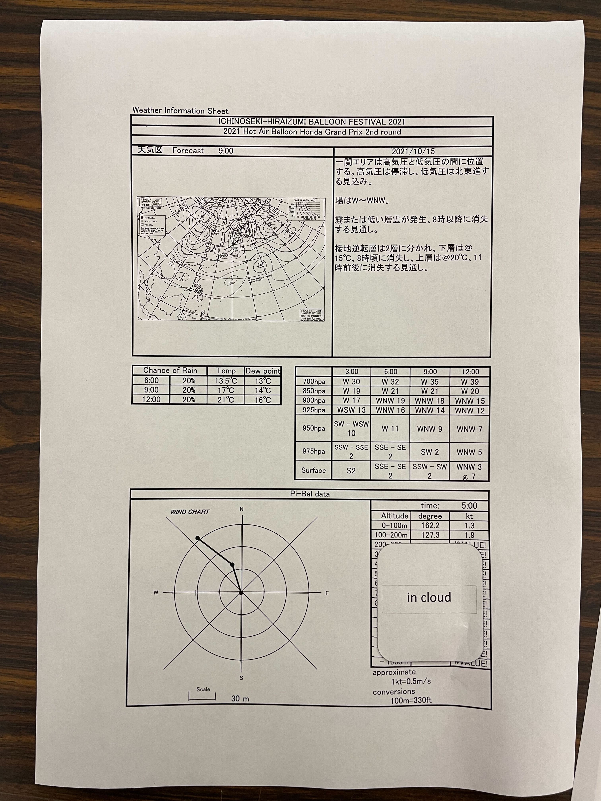
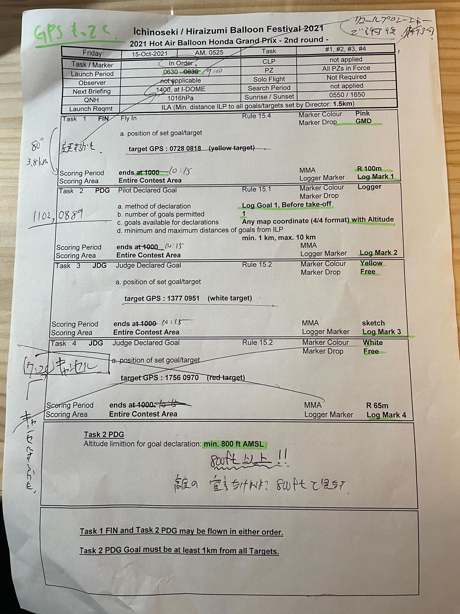
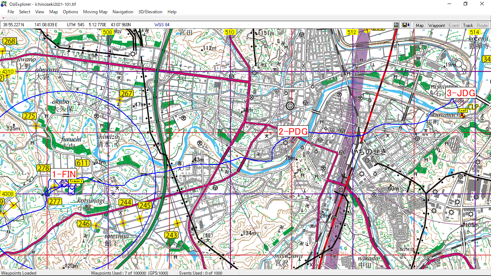
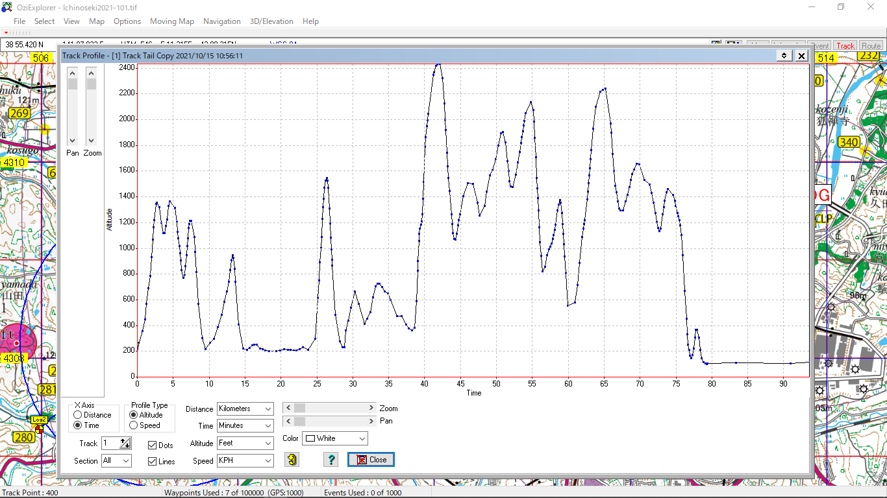

# Date
2021/10/15 
一関BF2021 DAY1 AM

# Wether

# Task

# Track

# Altitude

# Report

濃霧のため離陸許可がおりずにしばらく待機．離陸場所の選定はなかなかよかった．安全に離陸できる場所で，心に余裕を持って立ち上げを行えた．

`#1 FIN` は一回目のアプローチで	30 m ほどまで寄ったが，ロガードロップ，マーカー投下ともにせず，もっと粘ろうと判断．風がころころと変わっており，以降のアプローチはこれ以上近寄れなかったので，この判断は失敗．また，ロガードロップの最小距離は 50 m なので，一回目のアプローチで少なくともロガーはドロップするべきだった．

> **指針**：上風が速く，かつ下風と角度が全く違う場合は下風では合わせにくい．あまり下で合わせるプランでいかずに，初回上から突っ込んである程度のリザルトでまとめて次へ行くべき．

`# PDG` は高度800 ft に宣言していたが，`#3 JDG` へ向かう1500 ft と全く角度が変わってしまうため，合わせるのが大変だった．安定して吹いていた1500 ft 付近を宣言できていれば，そのまま `#3 JDG` に迎えてテンポよくできた．

`#3 JDG` はアプローチラインの選択はすこしだけおろし始めるのが速い，もしくは急降下しすぎた．ここら辺はもう少し西側にマージンを取って徐々におろしていたら調節できる範囲だっただろう．

# Result

http://www.exem-balloon.com/Ichinoseki21Results/Mobile/ic21Index.html

`#1 FIN` は 800 ft ほどから急降下でアプローチした際に，対地 300ft 程を飛んでいた気球と球皮同士が接触し， `balloon colistion` 600 点ペナルティ．

衝突前20 秒の平均下降速度は2.8 m．四捨五入で3m とみなし，`COMPETITION OPERATIONS HANDBOOK` に照らし合わせて減点される．

今回のケースでは上空から一連のアプローチで接触しており，もし衝突前に一回速度を0に落としてレベルを取ってから，再度リップを引いてアプローチすれば減点はされなかったと推測される．

## 10.1 MIDAIR COLLISION in the [COMPETITION OPERATIONS HANDBOOK](http://www.jballoon.jp/sport/fai/coh_2018_-_final.pdf)

> GPS loggers provide a means to objectively determine what happened when climbing too fast
or in case of a balloon collision. The tracks should be examined in case of observed and/or
reported collisions. As a reaction to multiple serious collisions during the 2006 WHABC, the
RSC at their meeting in 2007 decided to provide strong guidance on how to treat collisions. Any
collision other than trivial envelope ‘touches’ (under AXMER R10.1.4) should be considered
dangerous and penalized. Generally the idea is the more forceful the collision, the higher the
penalty. Also, the principle should be that the one that could have avoided the problem best
should be more severely penalised, which usually is the higher balloon. However this does not
relieve the lower or climbing competitor from responsibility. In general, one can presuppose that
a competitor climbing fast in competition acknowledges responsibility for collisions. For
example, if a competitor climbing at 10 metres / second hits a balloon flying level then we would
suggest 75% of responsibility was with the climbing competitor and 25% was with the level
flying one. If however, a fast descending competitor hits a balloon flying level, the descending
competitor should be assessed 100% responsibility and likewise, 100% of the penalty given.
Although rather difficult and subjective, when possible the aspects of recklessness and
irresponsibility should be addressed. If a competitor is a repeat offender, he should be strongly
penalised up to disqualification.
New competitors not used to flying in large events tend to not pay enough attention. This may
be addressed at the general briefing and should not be a reason to reduce a penalty. The
guidance mentioned above also applies to collisions during take-off and landings.

GPSロガーは、上昇速度が速すぎた場合や気球の衝突の際に何が起こったかを客観的に判断する手段となります。衝突が確認された場合や報告された場合には、トラックを調査する必要があります。2006年のWHABCで複数の深刻な衝突が発生したことを受けて、2007年のRSCの会合では、衝突をどのように扱うかについて強い指針を示すことが決定されました。些細なエンベロープの「タッチ」（AXMER R10.1.4）以外の衝突は危険とみなされ，ペナルティが課せられます。一般的には、衝突が強ければ強いほど、ペナルティも高くなるという考え方です。また，問題を最もよく回避できた者がより厳しく罰せられるべきであり，それは通常，上位の気球である。しかし、これは下位の競技者や上昇中の競技者の責任を免除するものではありません。一般的に、競技中に高速で登っている競技者は、衝突の責任を認めていると考えられます。例えば、秒速10mで登っている競技者が水平に飛んでいる気球に衝突した場合、責任の75%は登っている競技者にあり、25%は水平に飛んでいる競技者にあると考えられます。しかし、高速で降下している競技者が水平に飛んでいる気球にぶつかった場合、降下している競技者に100％の責任があり、同様に与えられたペナルティも100％とすべきである。かなり困難で主観的ではあるが、可能であれば無謀さと無責任さの側面に対処すべきである。もし競技者が繰り返し違反をした場合は、失格までの強い罰則が与えられるべきである。大きなイベントでの飛行に慣れていない新しい競技者は、十分な注意を払わない傾向がある。これは一般的なブリーフィングで扱われるかもしれないが、ペナルティを軽減する理由になってはならない。上記のガイダンスは、離着陸時の衝突にも適用される。
