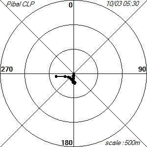
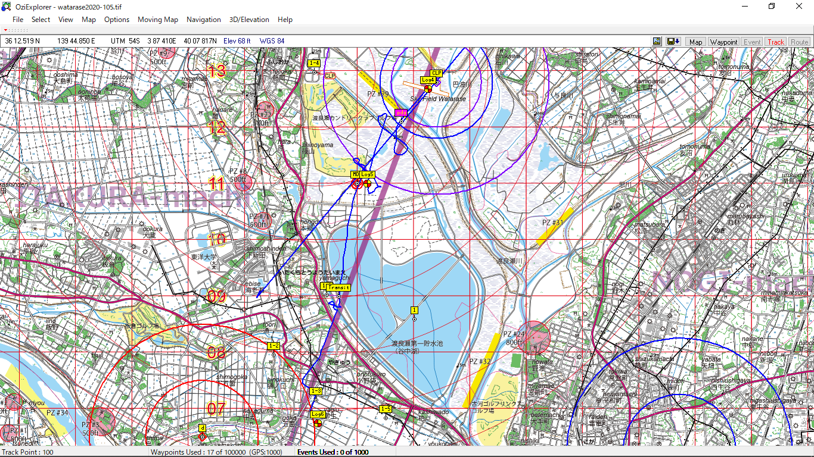
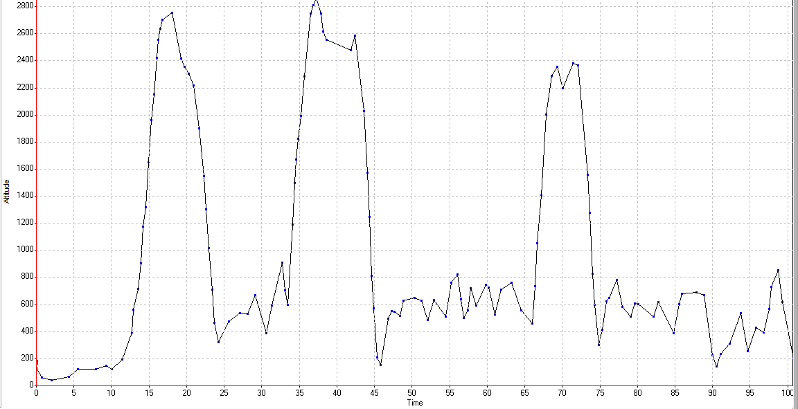

# Wether

```
[Pibal] Pibal CLP
Date  2021/10/03 05:30
Alt = [ AGL ]	Wind = [ To ]
------------DATA------------
     m	 m/s 	Deg
----------------------------
   50	  1.1 	  184
  100	  1.1 	  187
  150	  1.2 	  180
  200	  1.6 	  192
  250	  1.1 	  174
----------------------------
  300	  1.1 	  123
  350	  0.7 	   39
  400	  1.4 	  311
  450	  1.8 	  311
  500	  1.5 	  315
----------------------------
  550	  1.2 	  297
  600	  2.3 	  279
  700	  3.0 	  271
--------- data end ---------
```



# Task

[watchmefly](https://watchmefly.net/events/tds_print.php?e=pukapucup2021&fid=52D9B752-3441-9623-E23A-6DC2044318D9) 参照

# Track



# Altitude



# Report

## crew
じげん(P2)，にこるん(driver)，お嬢，どんちゃん

## abstruct

先飛びした気球を風見にすると，方角が `220 [deg]` とよさそうだったので，`#1 PDG` は `#2 MDD` との直線上に宣言．

`#3 3DT` はフライトプランをシンプルにするために，`#4 HWZ` と分離した場所に宣言．

結果的にはガス欠になり，片足突っ込んだだけで降りてしまったため，このプランは失敗．

鍵となった風は，`2500 ft` 付近の南東風だった．これを使って MDD を修正できた．

この風は `HWZ 1-2` へ向かおうとしている途中に弱くなり，ガスが持たないと判断．

下風の NNE は安定して吹いていたので，`HWZ 1-3` へ変更してアプローチ．

その後，3DT に少し入ったところで安全のために着陸．

上空の無線機のリグが誤操作で回ってしまい，地上からの風情報を受け取れなかった．要改善．


# Result

[watchmefly](https://watchmefly.net/events/event.php?e=pukapucup2021&v=tt) 参照

